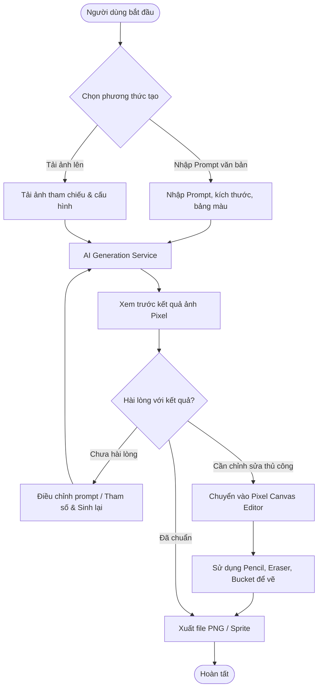

# User Flow

## Luồng người dùng chính (Main User Workflow)

```mermaid
flowchart TD
    Start([Người dùng bắt đầu]) --> ModeSelect{Chọn phương thức tạo}
    
    ModeSelect -- Nhập Prompt văn bản --> TextGen[Nhập Prompt, kích thước, bảng màu]
    ModeSelect -- Tải ảnh lên --> ImgGen[Tải ảnh tham chiếu & cấu hình]
    
    TextGen --> AIService[AI Generation Service]
    ImgGen --> AIService
    
    AIService --> Preview[Xem trước kết quả ảnh Pixel]
    
    Preview --> Decision{Hài lòng với kết quả?}
    Decision -- Chưa hài lòng --> Regenerate[Điều chỉnh prompt / Tham số & Sinh lại]
    Regenerate --> AIService
    
    Decision -- Cần chỉnh sửa thủ công --> Editor[Chuyển vào Pixel Canvas Editor]
    Editor --> Paint[Sử dụng Pencil, Eraser, Bucket để vẽ]
    Paint --> Export
    
    Decision -- Đã chuẩn --> Export[Xuất file PNG / Sprite]
    Export --> End([Hoàn tất])
```
